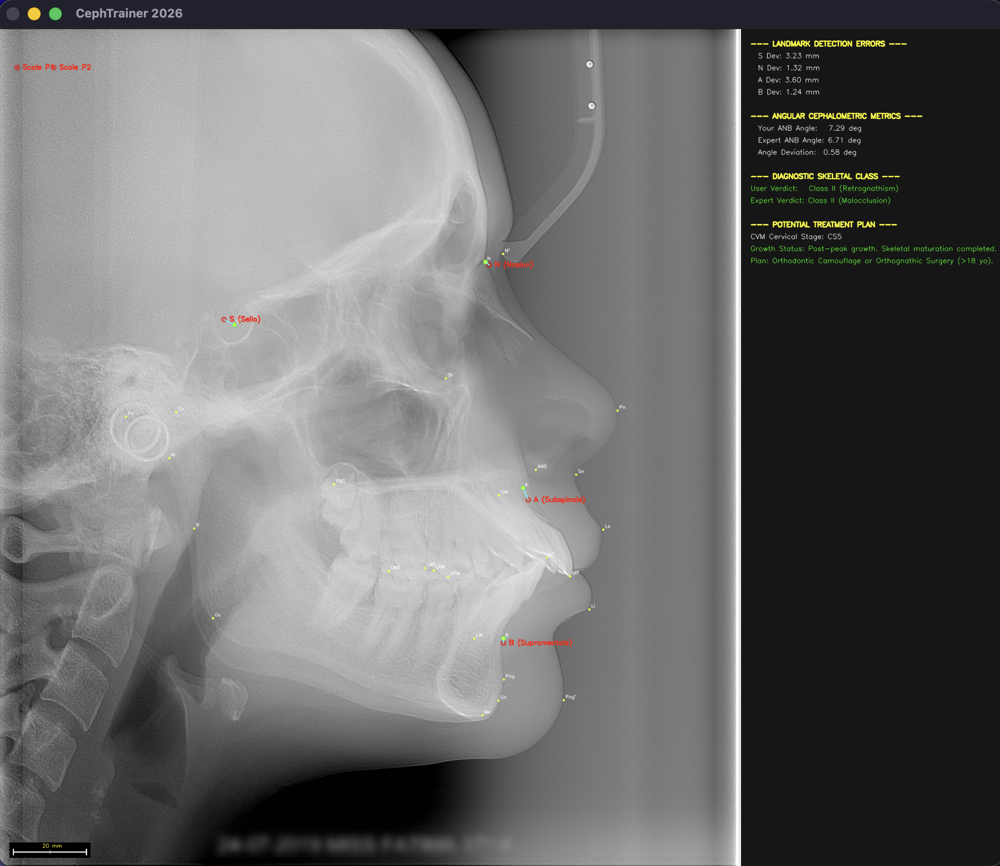

# CephTrainer v1.0



## 🚀 O projekcie

**CephTrainer** to narzędzie stworzone do automatyzacji i wspomagania analizy cefalometrycznej. Program pozwala użytkownikom na precyzyjne wyznaczanie punktów anatomicznych na zdjęciach rentgenowskich, automatyczne wyliczanie wskaźników szkieletowych oraz diagnozowanie fazy wzrostu kręgów szyjnych (CVM) przy wsparciu dedykowanych baz danych medycznych.

Projekt łączy algorytmy wizji komputerowej (OpenCV) z inteligentnym silnikiem diagnostycznym, umożliwiając szybkie porównanie diagnozy użytkownika z wynikami ekspertów.

---

## 🛠️ Kluczowe funkcjonalności

- **Wizualizacja i kalibracja:** Precyzyjne nanoszenie punktów anatomicznych z dynamicznym przelicznikiem pikseli na milimetry.
- **Analiza szkieletowa:** Automatyczne klasyfikowanie klasy zgryzu (Class I, II, III) na podstawie kąta ANB.
- **Silnik diagnostyki wzrostu:** Inteligentne wczytywanie danych CVM (Cervical Vertebral Maturation) z plików JSON z unikalnym systemem obsługi błędów i literówek w bazie.
- **Wsparcie decyzji klinicznej:** Automatyczne generowanie potencjalnych planów leczenia (np. aparaty typu Twin Block, Herbst, ekspansja podniebienia) na podstawie zaawansowania wzrostu pacjenta.
- **System walidacji:** Dynamiczne informowanie użytkownika o poprawności diagnozy za pomocą kolorystycznego systemu werdyktów (zielony/czerwony).

---

## 📋 Wymagania techniczne

- **Język:** C++17 lub nowszy.
- **Biblioteki:** \* OpenCV 4.x (z obsługą `imgproc`, `highgui`, `videoio`).
  - nlohmann/json (do bezpiecznego parsowania plików danych).
- **System:** Linux / macOS / Windows (ze skonfigurowanym środowiskiem C++).

---

## 🚀 Start

1. Sklonuj repozytorium.
2. Upewnij się, że struktura katalogów `data/Cephalograms`, `data/CVM_Stages`, `data/Senior_Orthodontists` jest poprawnie wypełniona plikami pacjentów.
3. Skompiluj projekt za pomocą polecenia:
   ```bash
   g++ -std=c++17 -I/opt/homebrew/include -o ceph_app *.cpp `pkg-config --cflags --libs opencv4`
   ```
