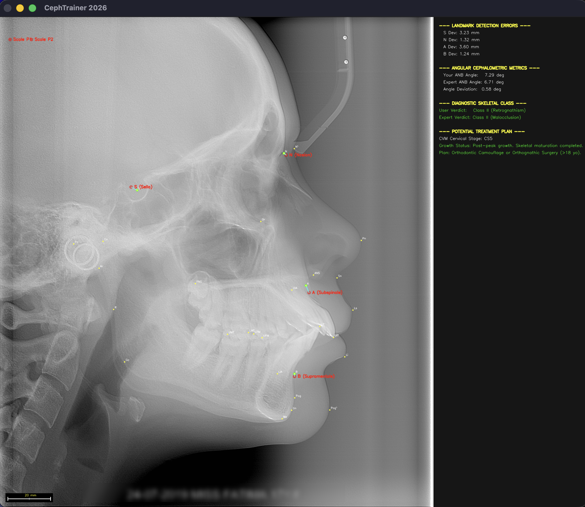

# CephTrainer



**CephTrainer** to narzędzie stworzone do automatyzacji i wspomagania analizy cefalometrycznej. Program pozwala użytkownikom na precyzyjne wyznaczanie punktów anatomicznych na zdjęciach rentgenowskich oraz diagnozowanie fazy wzrostu kręgów szyjnych (CVM) przy wsparciu dedykowanych medycznych baz danych.

## Jak to działa?

Program służy do nauki analizy cefalometrycznej. Użytkownik:
1. Zaznacza dwa punkty odniesienia (skalę)
2. Zaznacza cztery główne punkty anatomiczne (S, N, A, B)
3. Otrzymuje analizę z porównaniem do eksperta
4. Widzi plan leczenia na podstawie fazy wzrostu pacjenta

### Punkty Anatomiczne

- **S (Sella)** — wgłębienie tureckie, punkt środkowy podstawy czaszki
- **N (Nasion)** — czubek nosa, punkt przedniego profilu czaszki
- **A (Subspinale)** — punkt między nozdrami a górnymi zębami przedniego
- **B (Supramentale)** — punkt między dolnymi zębami przednimi a brodą

### Analiza

Po zaznaczeniu wszystkich punktów program:
- Oblicza kąt ANB (podstawowa miara klasyfikacji)
- Klasyfikuje pacjenta do klasy skeletowej (I, II, III)
- Porównuje wyniki z danymi eksperta
- Sugeruje plan leczenia na podstawie fazy wzrostu (CVM)

## Wymagania

- C++17 (g++, clang lub MSVC)
- CMake 3.16+
- OpenCV 4.0+
- nlohmann/json

## Instalacja

### macOS

```bash
brew install opencv nlohmann-json cmake
```

### Linux (Ubuntu/Debian)

```bash
sudo apt update
sudo apt install libopencv-dev nlohmann-json3-dev cmake build-essential
```

### Windows

Użyj vcpkg:
```cmd
git clone https://github.com/Microsoft/vcpkg.git
cd vcpkg
.\bootstrap-vcpkg.bat
.\vcpkg install opencv:x64-windows nlohmann-json:x64-windows
```

## Build

```bash
mkdir build
cd build
cmake .. -DCMAKE_BUILD_TYPE=Release
cmake --build .
cd ..
```

Executable: `build/CephTrainer` (Linux/macOS) lub `build/Release/CephTrainer.exe` (Windows)

## Przygotowanie Danych

Struktura folderów:

```
project/
├── data/
│   ├── Cephalograms/           # Obrazy RTG (.png)
│   ├── Senior_Orthodontists/   # Punkty eksperta (.json)
│   └── CVM_Stages/             # Fazy wzrostu (.json)
└── build/
    └── CephTrainer             # Executable
```

### Format Landmarks JSON

Plik: `data/Senior_Orthodontists/001.json`

```json
{
  "landmarks": [
    {"symbol": "S", "value": {"x": 300, "y": 250}},
    {"symbol": "N", "value": {"x": 350, "y": 150}},
    {"symbol": "A", "value": {"x": 380, "y": 350}},
    {"symbol": "B", "value": {"x": 400, "y": 400}}
  ]
}
```

### Format CVM JSON

Plik: `data/CVM_Stages/001.json`

```json
{
  "cvm_stage": {
    "value": 3
  }
}
```

Wartości CVM: 1-6 (fazy wzrostu czaszki)

### Format Obrazu

Plik: `data/Cephalograms/001.png`

Obraz w formacie PNG. Rekomendowany rozmiar: minimum 512×512 pikseli.

## Uruchomienie

```bash
cd build
./CephTrainer      # Linux/macOS
CephTrainer.exe    # Windows
```

Aplikacja będzie szukać folderu `data/` w stosunku do lokacji executable. Upewnij się, że uruchamiasz z folderu zawierającego `data/` lub ustaw zmienną:

```bash
export CEPH_DATA_DIR=/ścieżka/do/data
./CephTrainer
```

## Workflow Aplikacji

1. **Menu Startowe** — Wybierz pacjenta z listy dostępnych skanów
2. **Kalibracja** — Kliknij dwa punkty linii (10mm) aby ustawić skalę
3. **Zaznaczanie Punktów** — Kliknij kolejno: S, N, A, B
4. **Wyniki** — Program pokazuje:
   - Odchylenia każdego punktu od eksperta (w mm)
   - Kąt ANB użytkownika vs eksperta
   - Klasyfikację skeletową
   - Zalecenia leczenia

## Architektura

Projekt podzielony na moduły:

- **DataManager** — Zarządzanie ścieżkami i skanowanie dysku
- **PatientLoader** — Wczytywanie obrazów i danych JSON
- **CephalometricAnalyzer** — Obliczenia kątów i klasyfikacja
- **Renderer** — Rysowanie interfejsu (OpenCV)
- **CephTrainer** — Kontrola aplikacji i obsługa zdarzeń

## Rozwiązywanie Problemów

### "NO PATIENT FILES FOUND"

Upewnij się że:
- Jesteś w poprawnym katalogu roboczym
- `data/Cephalograms/` zawiera pliki `.png`
- Nazwy plików się zgadzają w folderach (np. `001.png` i `001.json`)

### CMake nie znajduje OpenCV

**macOS:**
```bash
cmake .. -DCMAKE_PREFIX_PATH=$(brew --prefix opencv)
```

**Linux (jeśli OpenCV w niestandardowym miejscu):**
```bash
cmake .. -DCMAKE_PREFIX_PATH=/usr/local/opencv
```

### Błędy kompilacji

Upewnij się że masz C++17:
```bash
g++ --version
clang --version
```

## Licencja

[Twoja licencja]

## Autor

[Twoje dane]
